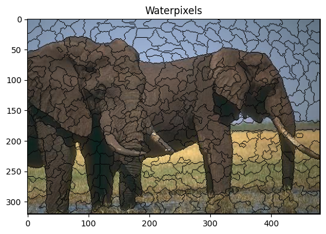

# Waterpixels Project

**Authors:**

Yanis Aït El Cadi,  
Zakaria Chahboune

This project demonstrates the use of image processing techniques to segment images into superpixels using waterpixels. The provided Jupyter notebook contains step-by-step implementations and visualizations of the process.

Additionally, a Streamlit web application has been created to allow users to test the code and produce their own results by choosing different parameters interactively.

The waterpixels generation method is based on the following research paper :

https://hal.archives-ouvertes.fr/hal-01212760/document

## Table of Contents
- [Introduction](#introduction)
- [Requirements](#requirements)
- [Usage](#usage)
- [Notebook Overview](#notebook-overview)
- [Streamlit Web App](#streamlit-web-app)
- [Results](#results)

## Introduction
Superpixel segmentation is a preprocessing step in many computer vision tasks. This project uses a waterpixels approach, which leverages watershed segmentation techniques. The notebook explains each step of the process, including image preprocessing, gradient calculation, and the final segmentation.

## Requirements
To run the notebook and the Streamlit web app, you need the following packages:
- Python 3.x
- NumPy
- OpenCV
- Matplotlib
- Scikit-Image
- Streamlit

You can install the required packages using pip:
```sh
pip install numpy opencv-python matplotlib scikit-image streamlit
```

## Usage
1. Clone the repository:
   ```sh
   git clone https://github.com/yourusername/waterpixels-project.git
   ```
2. Navigate to the project directory:
   ```sh
   cd waterpixels-project
   ```
3. To run the Jupyter notebook:
   ```sh
   jupyter notebook Waterpixels.ipynb
   ```
4. To launch the Streamlit web app:
   ```sh
   streamlit run streamlit_app.py
   ```
   Or click this [link](https://zakc02-waterpixels-streamlit-app-dcjkkh.streamlit.app/)

## Notebook Overview
The notebook includes the following sections:
1. **Image Preprocessing**: Loading and converting images to grayscale.
2. **Morphological Operations**: Applying opening and closing operations.
3. **Gradient Calculation**: Computing the gradient of the image.
4. **Markers and Watershed**: Creating markers and applying the watershed algorithm.
5. **Visualization**: Displaying the results of each step.

## Streamlit Web App
The Streamlit web app allows you to interactively test the waterpixels segmentation on your own images. You can upload an image, adjust parameters like gradient threshold or marker placement, and visualize the results directly in your browser.

To use the app:
1. Run the command `streamlit run app.py` in the project directory.
2. Upload an image and tweak the parameters as desired.
3. View the real-time segmentation results and download them if needed.

## Results
The notebook and web app provide visualizations at each step of the process, allowing you to understand the intermediate results and the final waterpixel segmentation. Here is an example of the output:


